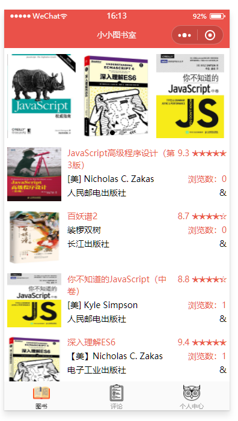
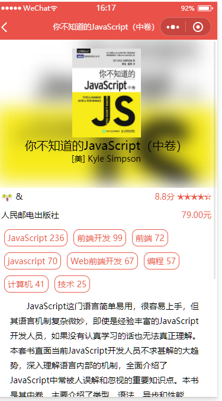
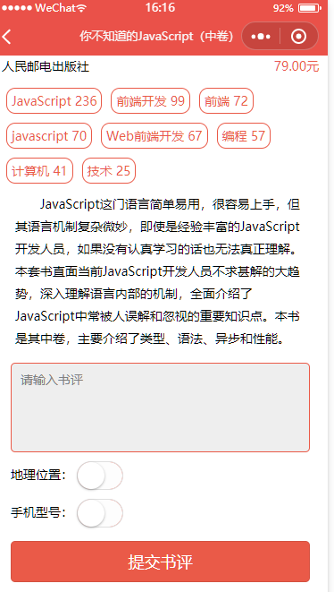
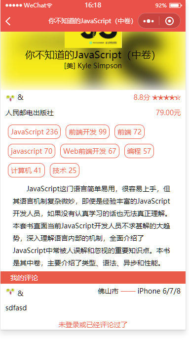
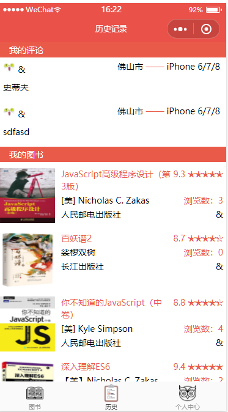
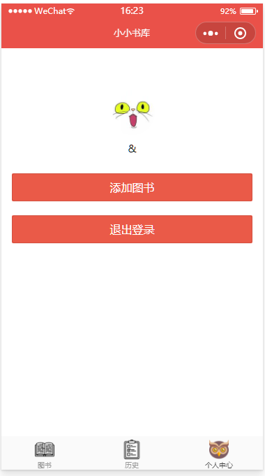

# snail-book

> A Mpvue project

## Build Setup

``` bash
# 初始化项目
vue init mpvue/mpvue-quickstart myproject
cd myproject

# 安装依赖
yarn

# 开发时构建
npm dev

# 打包构建
npm build

# 指定平台的开发时构建(微信、百度、头条、支付宝)
npm dev:wx
npm dev:swan
npm dev:tt
npm dev:my

# 指定平台的打包构建
npm build:wx
npm build:swan
npm build:tt
npm build:my

# 生成 bundle 分析报告
npm run build --report
```

For detailed explanation on how things work, checkout the [guide](http://vuejs-templates.github.io/webpack/) and [docs for vue-loader](http://vuejs.github.io/vue-loader).

# 功能

## 首页




## 图书详情

### 未评论





### 已评论或未登录



## 历史记录



## 个人中心

